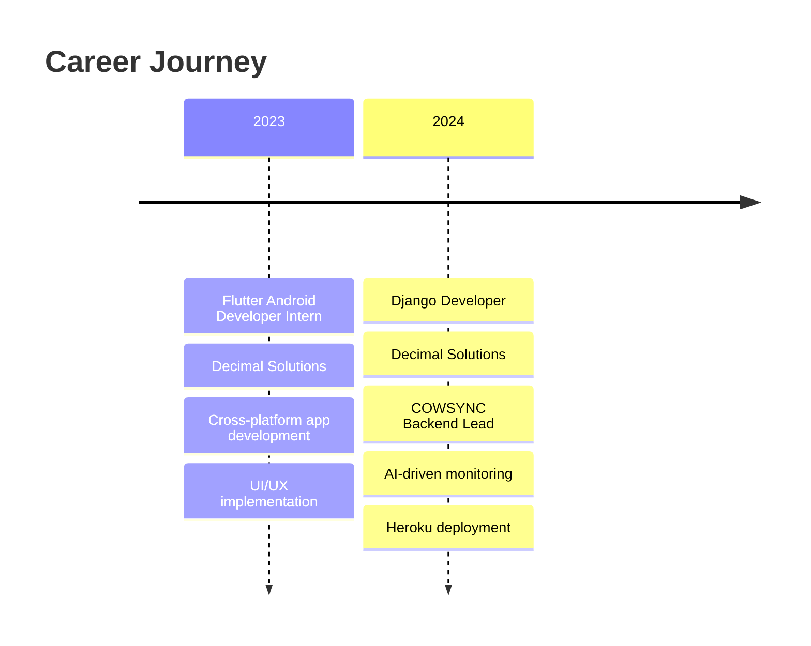
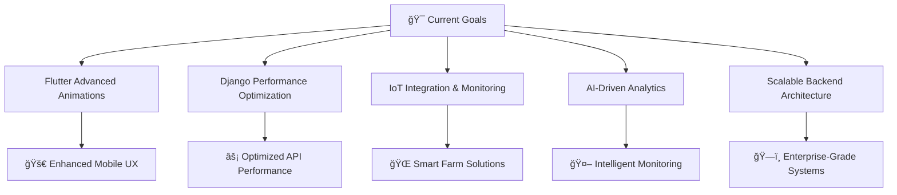

<div align="center">
  
# 👋 Hello, I'm Aizan Ahmed

### 🚀 Full-Stack Developer | Flutter Enthusiast | Django Expert


[](https://github.com/aizyy008)

</div>

---

## 🏆 Key Achievements & Recognition

<div align="center">

| 🥈 **2nd Position** | 🥇 **1st Position** | 📝 **Merit List** |
|:---:|:---:|:---:|
| **Software Engineering Project** | **ICATS Science Contest** | **DAWN Spelling Bee** |
| VisioSpark 2024 Competition | Institution Level 2017 | Provincial Level |
| *Among 25 projects* | *Science Excellence* | *Linguistic Skills* |

</div>

---

## 💼 Professional Experience

<div align="center">



</div>

---

## 🚀 Featured Projects

<div align="center">

### 🐄 **COWSYNC** - *Livestock Management System*
[](https://github.com/aizyy008)

*Feb 2024 - Jan 2025*

**Tech Stack:** Django | Flutter | IoT | AI Analytics | Geofencing

🔹 Comprehensive farm management with health tracking  
🔹 Inventory management & IoT sensor integration  
🔹 Disease detection with AI-powered monitoring  
🔹 Geofencing for efficient farm operations  

---

### 🦠 **COVID-19 Tracking App** - *Real-time Statistics*
[](https://github.com/aizyy008)

*April 2022*

**Tech Stack:** Flutter | REST APIs | Data Visualization

🔹 Real-time global COVID-19 statistics  
🔹 Interactive charts & trend analysis  
🔹 Intuitive interface for health data access  

</div>

---

## 🎯 About Me

```yaml
name: Aizan Ahmed
role: Software Engineer | Django Developer | Flutter Expert
location: Lahore, Punjab, Pakistan
company: The Semantics
experience: Full-stack development with scalable applications
specialization: Clean coding, API optimization, security
methodology: Agile environments & collaborative development
currently_learning: Advanced Flutter animations & Django optimization
collaboration: Open to Flutter/Django projects
contact: malikaizan198@gmail.com
linkedin: linkedin.com/in/aizan-ahmed
```

<div align="center">

### 🏆 GitHub Achievements

[](https://github.com/ryo-ma/github-profile-trophy)

</div>

---

## 🛠️ Tech Arsenal

<div align="center">

### 📱 Frontend & Mobile


### ⚙️ Backend & Server


### 🗄️ Databases


### 🔧 Tools & Technologies


### 🚀 Methodologies & Practices


</div>

---

## 📊 GitHub Analytics

<div align="center">
  


</div>

<div align="center">

[](https://git.io/streak-stats)

</div>

---

## 🎯 Current Focus

<div align="center">



</div>

---

## 🤝 Let's Connect & Collaborate

<div align="center">

[](mailto:malikaizan198@gmail.com)
[](https://www.linkedin.com/in/aizan-ahmed)
[](https://fb.com/aizan%20ahmed)
[](https://instagram.com/bugz__x)
[](https://github.com/Aizyy008)
[](https://github.com/Aizyy008?tab=repositories)

### 💡 Open to collaborating on:
- 🐄 **Agricultural & IoT solutions**
- 📱 **Cross-platform mobile applications**
- 🌐 **Enterprise Django platforms** 
- 🔗 **Full-stack scalable projects**
- 🤖 **AI-powered monitoring systems**
- 💼 **Fintech & business solutions**

</div>

---

<div align="center">

### 💭 Developer Quote

*"The best way to predict the future is to create it."*


---

**⭐ From [Aizan Ahmed](https://github.com/aizyy008) with ❤️**

*Last updated: 2025*

</div>
